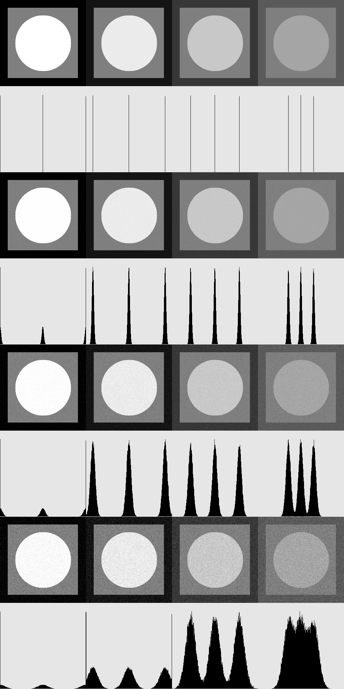

## Лабораторная 02 (гистограммы и аддитивный шум)
1. написать функцию для генерации тестового изображения с тремя уровнями яркости

	(256 - сторона изображения, 209 - сторона внутреннего квадрата, 83 - радиус круга)
2. написать функцию для рисования гистограммы яркости на квадратном растре со стороной 256 в виде столбиков шириной в 1px яркости 0 на фоне 230, нормировку сделать так, чтобы максимальное значение имело высоту 230
3. написать функцию зашумления (аддитивный нормальный несмещенный шум с заданным значением среднеквадратичного отклонения)
4. сгенерировать тестовые изображения для 4-х наборов уровней и склеить слева-направо

	[0,127,255]

	[20,127,235]

	[55,127,200]

	[90,127,165]
5. сгенерировать зашумленные изображения и гистограммы, которые размещаются встык ниже тестового изображения
6. зашумление сделать для трех значений среднеквадратичного отклонения 3, 7, 15
7. склеить все изображения в одно
8. исследовать параметры шума в областях равной яркости


## Запуск приложения

Скомпилируйте исходный код и запустите исполняемый файл.

```bash
./lab02

```

## Готовое фото
